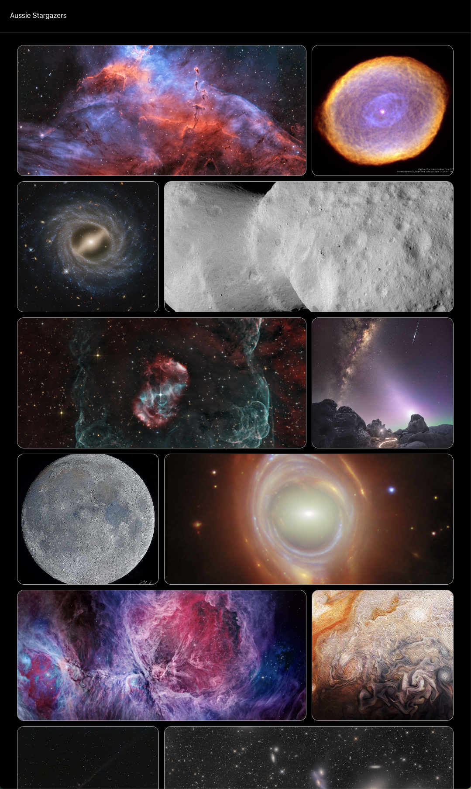

# 🌌 Aussie Stargazers

## 🚀 Description

**Aussie Stargazers** is a web application that brings the wonders of the cosmos to your screen. Leveraging NASA's Astronomy Picture of the Day (APOD) API, it showcases breathtaking astronomical images and detailed explanations, making stargazing accessible to everyone.

🔗 **Live Demo**: [https://aussiestargazers.vercel.app/](https://aussiestargazers.vercel.app/)

---

## 🛠️ Technologies Used

- **Frontend**: Next.js, TypeScript
- **UI Components**: Aceternity UI Components
- **API Integration**: NASA Astronomy Picture of the Day (APOD) API
- **Deployment**: Vercel
- **Development Tools**: VS Code, PostCSS, ESLint

---

## Things I Learned

- How to integrate third-party APIs (NASA APOD API) into a Next.js application.
- The importance of responsive design for creating user-friendly web applications.
- Leveraging modern UI component libraries (Aceternity UI Components) for faster development and polished designs.
- Using tools like Motion to enhance user experience with animations and dynamic content loading.

## 🙌 Acknowledgements

Special thanks to the following services and communities for making this project possible:

- **NASA**: For the incredible APOD API and its wealth of astronomical data
- **Aceternity UI Components**: For providing a clean and modern design system
- **Vercel**: For seamless hosting and deployment
- **Open Source**: Next.js, TypeScript, and React communities

---

## 🌟 Future Considerations

### Scaling
- Implement caching for API responses to improve performance
- Add support for user accounts to save favorite images
- Optimise for larger datasets and high traffic

### Feature Enhancements
- Add animations using Intersection Observer for a dynamic user experience
- Include a search feature for exploring past APOD entries
- Provide downloadable high-resolution images
- Add a calendar view for browsing images by date
- Integrate a stargazing guide for Southern Hemisphere constellations

---

## 📸 Screenshots

---

## 🧑‍💻 About Me

Hi, I'm Tristan! I'm a passionate developer with a love for astronomy and building engaging web applications. Aussie Stargazers is a project that combines my interests in space and technology, showcasing my skills in frontend development, API integration, and UI design.

🔗 **Portfolio**: [https://tjmb.dev](https://tjmb.dev)  

---